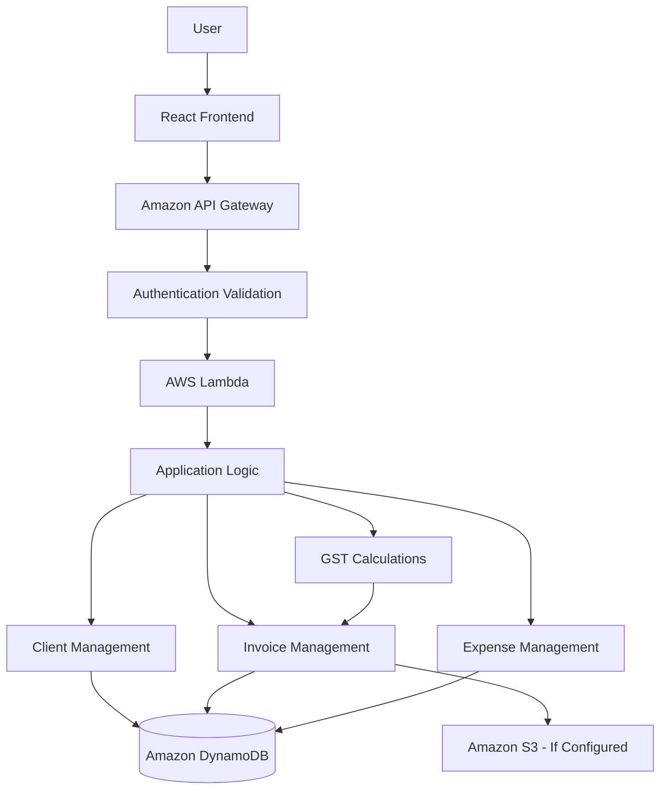
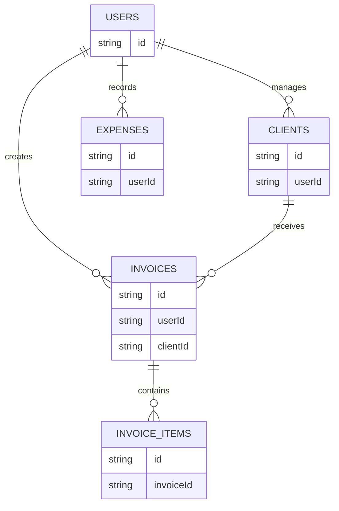

# GST-Ready Invoice & Expense Tracker

**Simplify your freelance finances with automated GST invoicing and expense management.**

A web-based financial management application designed to help freelancers organize clients, generate GST-aware invoices, track business expenses, and review financial summaries through a centralized dashboard.

> **Project Type:** Final-Year Engineering Project  
> **Domain:** Fintech and Accounting Automation  
> **Target Users:** Freelancers and Independent Professionals  
> **Recommended MVP Duration:** 1 Month

---

## Table of Contents

- [Project Overview](#project-overview)
- [Problem Statement](#problem-statement)
- [Objectives](#objectives)
- [Core Features](#core-features)
- [Functional Modules](#functional-modules)
- [Technology Stack](#technology-stack)
- [System Architecture](#system-architecture)
- [Software Design](#software-design)
- [GST Calculations](#gst-calculations)
- [Database Design](#database-design)
- [API Documentation](#api-documentation)
- [Security](#security)
- [Project Structure](#project-structure)
- [Installation and Setup](#installation-and-setup)
- [Environment Variables](#environment-variables)
- [AWS Deployment](#aws-deployment)
- [Testing](#testing)
- [Screenshots](#screenshots)
- [Project Demonstration](#project-demonstration)
- [Sample Invoice](#sample-invoice)
- [Limitations](#limitations)
- [Future Enhancements](#future-enhancements)
- [Academic Value](#academic-value)
- [Viva Quick Reference](#viva-quick-reference)
- [Contributing](#contributing)
- [License](#license)
- [Disclaimer](#disclaimer)

---

## Project Overview

### Introduction

Freelancers often manage invoices, client information, payments, and business expenses using spreadsheets or separate applications. This can make financial record-keeping time-consuming and increase the possibility of calculation errors.

The **GST-Ready Invoice & Expense Tracker** aims to simplify these activities by providing a centralized platform for client management, invoice generation, GST calculations, and expense tracking.

### Proposed Solution

The application is designed to help users:

- Create and manage client records.
- Generate GST-aware invoices.
- Calculate invoice subtotals, taxes, and totals.
- Record and categorize business expenses.
- Track invoice payment status.
- Download invoices as PDF files.
- View invoice and expense summaries.
- Monitor financial activity through a dashboard.

The application focuses on basic financial administration and educational demonstration. It does not replace professional accounting software or official GST filing systems.

### Project Information

| Attribute            | Details                                                                               |
| -------------------- | ------------------------------------------------------------------------------------- |
| Project Title        | GST-Ready Invoice & Expense Tracker                                                   |
| Tagline              | Simplify your freelance finances with automated GST invoicing and expense management. |
| Domain               | Fintech and Accounting Automation                                                     |
| Project Type         | Final-Year Engineering Project                                                        |
| Target Complexity    | Beginner                                                                              |
| Recommended Duration | 1 Month MVP                                                                           |
| Primary Purpose      | Invoice generation and expense tracking                                               |

---

## Problem Statement

Freelancers and independent professionals need to maintain organized records of their clients, invoices, payments, and business expenses.

Manual record-keeping can lead to inconsistent invoice formats, calculation errors, misplaced records, and difficulty tracking outstanding payments.

The proposed system aims to address these challenges through a centralized application that supports invoice creation, configurable GST calculations, expense recording, and basic financial reporting.

---

## Objectives

The primary objectives of the project are:

1. Develop a web application for managing freelance invoices and expenses.
2. Provide client management and invoice generation functionality.
3. Implement configurable GST calculations for supported invoice scenarios.
4. Maintain organized expense records with categories and dates.
5. Generate downloadable PDF invoices.
6. Present invoice, expense, and financial summaries through a dashboard.
7. Demonstrate full-stack development, authentication, database design, and cloud deployment.
8. Apply software engineering principles to create a maintainable application.

---

## Core Features

The following table represents the intended project scope. Update each status according to the actual implementation.

| Feature                | Description                           | Status  |
| ---------------------- | ------------------------------------- | ------- |
| User Registration      | Create a user account                 | Planned |
| User Login             | Authenticate users                    | Planned |
| Client Management      | Create and manage client records      | Planned |
| Invoice Management     | Create and manage invoices            | Planned |
| GST Calculations       | Calculate configurable GST amounts    | Planned |
| PDF Invoice Generation | Download invoices as PDF files        | Planned |
| Expense Management     | Record and categorize expenses        | Planned |
| Payment Tracking       | Track invoice payment status          | Planned |
| Dashboard              | Display invoice and expense summaries | Planned |
| Financial Reports      | Summarize income and expenses         | Planned |
| CSV Export             | Export financial records              | Planned |

**Status definitions**

- **Implemented:** Available and verified in the codebase.
- **Partially Implemented:** Some functionality is available, but the module is incomplete.
- **Planned:** Intended functionality that has not yet been implemented.

---

## Functional Modules

### 1. Authentication Module

The Authentication Module manages user access to the application.

Intended functionality:

- User registration.
- User login.
- Secure authentication.
- Protected application routes.
- Authentication error handling.
- Token or session management.
- Logout functionality.

The implementation should ensure that authenticated users can access only their own financial records.

Document the exact authentication mechanism according to the actual codebase.

### 2. User Profile Module

The User Profile Module manages information associated with the authenticated user.

Potential functionality:

- View profile information.
- Update account details.
- Manage business information.
- Maintain user-specific data isolation.
- Configure invoice-related business details.

Business information may include a business name, address, contact information, and GSTIN where applicable.

Only document profile fields and settings that are implemented.

### 3. Client Management Module

The Client Management Module stores information about customers for whom invoices are created.

Intended functionality:

- Add new clients.
- View the client list.
- View individual client details.
- Edit client information.
- Delete client records where supported.
- Associate invoices with clients.

Client information may include a name, email address, phone number, billing address, and GSTIN, depending on the implemented data model.

### 4. Invoice Management Module

The Invoice Management Module supports invoice creation and management.

Intended functionality:

- Create invoices for clients.
- Add product or service descriptions.
- Specify quantities and unit prices.
- Calculate line-item amounts.
- Calculate invoice subtotals.
- Apply configured GST rates.
- Calculate the final invoice amount.
- Record invoice dates and due dates.
- Track payment status.
- View and manage existing invoices.
- Generate downloadable PDF invoices where supported.

An invoice acts as a structured record of the products or services supplied to a client, including the corresponding amounts and applicable tax details.

### 5. Expense Management Module

The Expense Management Module records business-related expenditure.

Intended functionality:

- Add an expense.
- Record the expense amount.
- Specify the expense date.
- Select an expense category.
- Add a description or notes.
- View expense history.
- Edit or delete expenses where supported.
- Filter expenses by date or category where supported.

Example expense categories include software subscriptions, equipment, internet, travel, and office supplies.

### 6. Dashboard and Financial Reporting Module

The Dashboard Module provides a summarized view of invoice and expense activity.

| Metric             | Meaning                                                                       |
| ------------------ | ----------------------------------------------------------------------------- |
| Total Invoiced     | Total amount represented by invoices included in the selected period          |
| Total Paid         | Amount recorded as paid against invoices                                      |
| Outstanding Amount | Amount remaining unpaid according to the application's payment-tracking logic |
| Total Expenses     | Sum of recorded expenses included in the selected period                      |
| Invoice Count      | Number of invoices included in the summary                                    |
| Paid Invoices      | Number of invoices marked as paid                                             |
| Pending Invoices   | Number of invoices awaiting payment                                           |
| Expense Breakdown  | Distribution of expenses by category                                          |
| Financial Summary  | Overview of selected invoice and expense metrics                              |

The dashboard should clearly distinguish invoiced amounts, received payments, expenses, and profit. These values represent different financial concepts.

---

## Technology Stack

The project uses a web application architecture. The following technologies represent the proposed baseline and should be retained only when confirmed in the repository.

| Layer              | Technology                     | Purpose                                |
| ------------------ | ------------------------------ | -------------------------------------- |
| Frontend           | React 19                       | Component-based user interface         |
| Frontend Language  | TypeScript                     | Static type checking                   |
| Styling            | Tailwind CSS                   | Responsive interface styling           |
| HTTP Client        | Axios                          | Frontend-backend communication         |
| Backend            | Node.js                        | Server-side JavaScript runtime         |
| API Framework      | Express                        | REST API development                   |
| Backend Language   | TypeScript                     | Typed backend implementation           |
| Database           | Amazon DynamoDB                | Persistent application data            |
| Authentication     | Amazon Cognito / JWT           | User authentication                    |
| Serverless Compute | AWS Lambda                     | Backend function execution             |
| API Gateway        | Amazon API Gateway             | HTTP API access                        |
| Object Storage     | Amazon S3                      | Storage for supported files and assets |
| Deployment         | AWS SAM / Serverless Framework | Serverless deployment                  |

The final technology stack must reflect the dependencies and infrastructure configuration actually used by the project.

---

## System Architecture

The proposed system follows a frontend-backend architecture with cloud-hosted backend services.

### High-Level Architecture

```text
User
  |
  v
React Frontend
  |
  v
HTTP Requests
  |
  v
Amazon API Gateway
  |
  v
AWS Lambda
  |
  v
Application Logic
  |
  v
Amazon DynamoDB
```

The frontend provides the interface for managing clients, invoices, and expenses.

The backend validates requests, performs invoice and expense calculations, and interacts with the database.

Amazon API Gateway provides an HTTP entry point, while AWS Lambda executes backend logic. Amazon DynamoDB stores application data.

Amazon S3 may be used for generated invoice documents or static frontend assets if configured.

### Architecture Diagram



This diagram represents the proposed architecture. The deployed architecture may differ according to the actual implementation.

---

## Software Design

### Separation of Responsibilities

The application should separate interface code, request handling, business logic, and database operations.

Conceptual flow:

```text
API Route / Handler
        |
        v
Business Logic
        |
        v
Data Access Layer
        |
        v
Database
```

This separation helps keep invoice calculations, expense processing, and data-access operations organized.

### Repository Pattern

The Repository Pattern separates database operations from business logic.

A repository can provide methods for retrieving, creating, updating, and deleting records without requiring the business logic to directly manage database operations.

Conceptual flow:

```text
Controller / Handler
        |
        v
Service
        |
        v
Repository
        |
        v
Database
```

**Status:** Document this as implemented only if the codebase contains a distinct repository layer. Otherwise, classify it as a planned architectural improvement.

### Strategy Pattern

The Strategy Pattern allows different implementations of a behavior to be selected through a common interface.

For this project, it could be used to separate configurable tax calculation rules.

Conceptual example:

```text
Tax Calculation Strategy
├── Intra-State Calculation
└── Inter-State Calculation
```

**Status:** This is a possible design approach, not a confirmed implementation.

---

## GST Calculations

The application is intended to support GST-aware invoice calculations.

GST calculations must be configurable and should account for the invoice's applicable tax treatment. A single tax rate or treatment should not be assumed to apply to every transaction.

### 1. Line-Item Amount

For an invoice line item:

```text
Line Amount = Quantity × Unit Price
```

For multiple line items:

```text
Subtotal = Sum of all Line Amounts
```

### 2. GST Amount

For a taxable subtotal and a configured GST rate:

```text
GST Amount = Taxable Subtotal × GST Rate / 100
```

For example, if the taxable subtotal is ₹10,000 and the configured GST rate is 18%:

```text
GST Amount = 10,000 × 18 / 100
           = ₹1,800
```

This is an arithmetic example, not a determination that an 18% rate applies to a particular transaction.

### 3. CGST and SGST

For an eligible intra-state transaction where the applicable rate is split equally:

```text
CGST Rate = GST Rate / 2
SGST Rate = GST Rate / 2
```

```text
CGST Amount = Taxable Subtotal × CGST Rate / 100
SGST Amount = Taxable Subtotal × SGST Rate / 100
```

### 4. IGST

For an eligible inter-state transaction where IGST applies:

```text
IGST Amount = Taxable Subtotal × IGST Rate / 100
```

The application should apply the appropriate tax components rather than adding CGST, SGST, and IGST together indiscriminately.

### 5. Final Invoice Total

For a simple invoice without additional charges or adjustments:

```text
Invoice Total = Subtotal + GST Amount
```

Where supported, the calculation may also account for discounts, additional charges, and rounding.

### GST Calculation Considerations

The implementation should define:

- Available tax rates.
- Intra-state and inter-state treatment.
- Whether prices are tax-inclusive or tax-exclusive.
- How discounts affect the taxable amount.
- Rounding rules.
- Handling of exempt or non-taxable items.
- Required invoice fields.

GST calculations should be reviewed against applicable requirements before the application is used for actual tax compliance.

---

## Database Design

The proposed architecture uses Amazon DynamoDB, a NoSQL database.

The actual table names, partition keys, sort keys, indexes, and attributes must be documented from the database configuration and data-access code.

### Conceptual Entities

| Entity        | Purpose                                                  |
| ------------- | -------------------------------------------------------- |
| Users         | Stores or references user account information            |
| Clients       | Stores customer information                              |
| Invoices      | Stores invoice details and calculated totals             |
| Invoice Items | Stores individual products or services within an invoice |
| Expenses      | Stores business expense records                          |

These are conceptual entities. The actual implementation may use separate DynamoDB tables, a single-table design, nested attributes, or another structure.

### Conceptual Relationships



This is a conceptual diagram, not a verified physical database schema.

For each actual table or entity, document its purpose, keys, attributes, indexes, and relationships.

---

## API Documentation

The API reference must be generated from the implemented backend routes, Lambda handlers, validation logic, and response structures.

Include only endpoints that exist in the repository.

### Authentication

Potential responsibilities:

- User registration.
- User login.
- Token validation.
- Logout or session management.

If Amazon Cognito handles authentication directly, document the actual Cognito integration rather than inventing custom authentication endpoints.

### Clients

Potential responsibilities:

- Create a client.
- List clients.
- Retrieve client details.
- Update a client.
- Delete a client.

### Invoices

Potential responsibilities:

- Create an invoice.
- List invoices.
- Retrieve invoice details.
- Update an invoice.
- Delete or cancel an invoice where supported.
- Generate or retrieve a PDF invoice.

### Expenses

Potential responsibilities:

- Create an expense.
- List expenses.
- Retrieve expense details.
- Update an expense.
- Delete an expense.

### Dashboard and Reports

Potential responsibilities:

- Retrieve invoice summaries.
- Retrieve expense summaries.
- Retrieve payment summaries.
- Export financial records.

### API Reference Format

| Field            | Description                                           |
| ---------------- | ----------------------------------------------------- |
| Method           | HTTP method                                           |
| Endpoint         | Actual route path                                     |
| Authentication   | Whether authentication is required                    |
| Purpose          | Function performed by the endpoint                    |
| Request          | Actual body, path parameters, and query parameters    |
| Success Response | Actual response structure and status code             |
| Error Responses  | Relevant validation, authorization, and server errors |

Do not add endpoint paths, request fields, or response fields until they have been verified against the implementation.

---

## Security

The application handles user accounts, client information, invoices, and expense records. Security and data isolation are important design considerations.

### Security Controls

| Control                  | Purpose                                           |
| ------------------------ | ------------------------------------------------- |
| Authentication           | Verifies the identity of a user                   |
| Protected APIs           | Restricts access to authenticated operations      |
| User-Level Authorization | Prevents access to another user's records         |
| Input Validation         | Rejects invalid or malformed data                 |
| Secure Token Handling    | Reduces the risk of unauthorized token access     |
| Environment Variables    | Separates configuration from source code          |
| HTTPS                    | Protects information transmitted between services |
| CORS Configuration       | Controls permitted cross-origin browser requests  |
| IAM Permissions          | Restricts access to AWS resources                 |
| Error Handling           | Avoids exposing sensitive internal details        |
| Secret Management        | Keeps credentials out of source control           |

### Security Recommendations

- Do not commit API secrets, passwords, tokens, or cloud credentials.
- Validate requests on the backend.
- Enforce ownership checks for protected resources.
- Use least-privilege IAM permissions.
- Avoid exposing internal errors in API responses.
- Configure CORS and HTTPS appropriately.
- Protect generated invoice documents from unauthorized access.
- Avoid placing sensitive information in application logs.

Describe a security control as implemented only when it is verified in the codebase or deployment configuration.

---

## Project Structure

Replace this illustrative layout with the actual repository structure.

```text
gst-ready-invoice-expense-tracker/
├── frontend/
│   ├── src/
│   ├── public/
│   └── package.json
│
├── backend/
│   ├── src/
│   │   ├── handlers/
│   │   ├── services/
│   │   ├── repositories/
│   │   ├── middleware/
│   │   └── ...
│   └── package.json
│
├── infrastructure/
│   └── ...
│
├── tests/
├── .env.example
├── README.md
└── ...
```

Remove directories that do not exist and include the important configuration files present in the repository.

---

## Installation and Setup

The exact commands depend on the repository structure, package manager, scripts, and AWS configuration.

### Prerequisites

For the proposed architecture, development may require:

- Node.js.
- npm or the package manager specified by the repository.
- Git.
- An AWS account if deploying to AWS.
- AWS CLI if deployment commands require it.
- AWS SAM CLI or Serverless Framework, depending on the infrastructure configuration.

Use the Node.js version specified in the project configuration.

### Clone the Repository

Replace the placeholder with your GitHub repository URL.

```bash
git clone <YOUR_GITHUB_REPOSITORY_URL>
cd gst-ready-invoice-expense-tracker
```

### Install Dependencies

If the frontend and backend have separate `package.json` files:

```bash
cd frontend
npm install
```

Install backend dependencies:

```bash
cd ../backend
npm install
```

Use the package manager and commands specified by the repository if they differ.

### Configure Environment Variables

Create the required environment files using the project's configuration.

Illustrative example:

```env
PORT=
FRONTEND_URL=
API_BASE_URL=
AWS_REGION=
DYNAMODB_TABLE_NAME=
```

These variable names are examples only. Use the actual variable names required by the application.

Never commit real credentials or secrets.

### Run the Frontend

From the frontend directory, use the development script defined in `package.json`.

For example, if a `dev` script exists:

```bash
npm run dev
```

### Run the Backend

For a serverless backend, local execution depends on the framework and configuration.

If AWS SAM is configured for local development:

```bash
sam local start-api
```

Use this command only if the repository contains a compatible SAM template and local runtime configuration.

Otherwise, use the backend scripts defined in `package.json`.

---

## AWS Deployment

The proposed architecture uses AWS services for application hosting, authentication, data storage, and file handling.

Document only the services configured in the actual infrastructure.

### AWS Lambda

Potential responsibility:

- Execute backend application logic.
- Process API requests.
- Perform invoice and expense calculations.

### Amazon API Gateway

Potential responsibility:

- Expose HTTP endpoints.
- Route requests to backend functions.
- Integrate with authentication.

### Amazon Cognito

Potential responsibility:

- Manage user registration and authentication.
- Issue and validate tokens through the configured integration.

### Amazon DynamoDB

Potential responsibility:

- Store application records.
- Retrieve clients, invoices, and expenses.

### Amazon S3

Potential responsibility:

- Store generated invoice documents.
- Store frontend assets if configured for that purpose.

### Amazon CloudWatch

Potential responsibility:

- Collect application logs.
- Support monitoring where configured.

### Deployment Considerations

Before deployment:

1. Configure the required environment variables.
2. Verify AWS permissions.
3. Confirm database and storage configuration.
4. Configure API access and CORS.
5. Deploy using the framework configured by the project.
6. Test authentication and protected operations.
7. Verify user-level data isolation.
8. Confirm generated invoice files are accessible only as intended.

---

## Testing

Testing should cover invoice calculations, expense validation, authentication, and user-level data access.

The testing framework and commands must match the actual test configuration.

### Recommended Test Areas

| Test Category         | Purpose                                            |
| --------------------- | -------------------------------------------------- |
| Authentication Tests  | Validate registration, login, and protected access |
| Client Tests          | Validate client creation and management            |
| Invoice Tests         | Verify invoice creation and validation             |
| GST Calculation Tests | Verify tax calculations and invoice totals         |
| Expense Tests         | Validate expense creation and updates              |
| Authorization Tests   | Confirm user-level data isolation                  |
| PDF Tests             | Validate invoice document generation               |
| Dashboard Tests       | Verify summary calculations                        |
| API Tests             | Validate endpoint behavior and error responses     |

### Important Calculation Test Cases

1. Invoice containing a single line item.
2. Invoice containing multiple line items.
3. Invoice with a configured GST rate.
4. Invoice with invalid quantities.
5. Invoice with a discount, if supported.
6. Invoice with rounding-sensitive amounts.
7. Expense with a valid amount and date.
8. Expense with invalid input.
9. Dashboard totals for multiple invoices.
10. Dashboard totals for multiple expenses.
11. Invoice payment status and outstanding amount.
12. Attempts to access another user's invoice or expense.

These are recommended test cases, not claims that automated tests already exist.

Use the test commands defined in the repository's package scripts and configuration. Do not report coverage percentages unless measured.

---

## Screenshots

Screenshots will be added after the MVP UI is finalized.

Recommended screenshots:

- Login and registration page.
- Dashboard.
- Client management page.
- Invoice creation form.
- Invoice preview.
- Generated PDF invoice.
- Expense management page.
- Financial report.

Only add image references when the corresponding files exist in the repository.

---

## Project Demonstration

The following demonstration flow can be used by a faculty member to evaluate the application once the relevant features are implemented.

1. Register a user account.
2. Log in.
3. Open the dashboard.
4. Add a client.
5. Create an invoice.
6. Add service or product details.
7. Configure the applicable GST treatment.
8. Review the calculated invoice total.
9. Save the invoice.
10. Download the invoice as a PDF, if supported.
11. Record a payment or update invoice status, if supported.
12. Add a business expense.
13. Review the expense history.
14. Review invoice and expense summaries.
15. Export financial information, if supported.

---

## Sample Invoice

The following is an **illustrative example** demonstrating invoice arithmetic. It is not a real invoice and does not determine the legally applicable tax rate for any service or product.

| Field                      | Example                       |
| -------------------------- | ----------------------------- |
| Invoice Number             | INV-DEMO-001                  |
| Client                     | Example Client                |
| Description                | Freelance Development Service |
| Quantity                   | 1                             |
| Unit Price                 | ₹10,000                       |
| Subtotal                   | ₹10,000                       |
| Illustrative GST Rate      | 18%                           |
| Illustrative GST Amount    | ₹1,800                        |
| Illustrative Invoice Total | ₹11,800                       |

Calculation:

```text
Invoice Total = ₹10,000 + ₹1,800
              = ₹11,800
```

The GST rate is used solely to demonstrate the calculation. Actual tax treatment depends on the transaction and applicable requirements.

---

## Limitations

The following limitations may apply to the MVP. Update this section according to the actual implementation.

- **No official GST filing:** The application is not an official GST return-filing system.
- **Configurable tax calculations:** Calculated GST amounts depend on the settings and information entered by the user.
- **No professional tax advice:** The application does not determine a user's tax obligations.
- **No accounting-system integration by default:** External accounting integrations are outside the basic MVP scope.
- **No payment gateway by default:** Recording a payment does not mean the application processes payments.
- **No automatic bank synchronization by default:** Financial records may need to be entered manually.
- **Limited reporting:** The MVP may provide basic summaries rather than complete accounting reports.
- **No guaranteed compliance:** Generated invoices should be reviewed for applicable legal and tax requirements.
- **Cloud dependency:** AWS-hosted functionality depends on the configured services.

---

## Future Enhancements

The following features may be considered after the MVP. They are not presented as existing functionality.

### Invoice and Client Management

- Recurring invoices.
- Custom invoice templates.
- Business branding.
- Automated payment reminders.
- Client-specific invoice history.
- Multiple business profiles.

### Expense Management

- Receipt image uploads.
- Receipt data extraction.
- Advanced expense categorization.
- Recurring expense tracking.
- Expense approval workflows.

### Financial Reporting

- Monthly and yearly financial reports.
- Revenue and expense trends.
- Tax-period summaries.
- Downloadable CSV reports.
- Advanced dashboard visualizations.

### Integrations and Automation

- Payment gateway integration.
- Bank transaction imports.
- Accounting software integrations.
- Email invoice delivery.
- Automated reminders.
- Enhanced PDF generation.

### Cloud and Engineering

- Automated deployment pipelines.
- Infrastructure as Code.
- Expanded automated test coverage.
- Improved monitoring and alerting.
- Multi-currency support.

---

## Academic Value

The GST-Ready Invoice & Expense Tracker demonstrates the application of software engineering concepts to a practical business problem.

| Concept                           | Application                                                |
| --------------------------------- | ---------------------------------------------------------- |
| Software Requirements Engineering | Defining invoice and expense management requirements       |
| Frontend Development              | Building forms, dashboards, and application pages          |
| Backend Development               | Implementing business logic and API operations             |
| REST API Architecture             | Connecting frontend and backend services                   |
| Authentication                    | Managing access to protected resources                     |
| Database Design                   | Organizing clients, invoices, and expenses                 |
| Cloud Computing                   | Using managed cloud services where implemented             |
| Financial Calculations            | Computing invoice totals, taxes, and expense summaries     |
| Data Visualization                | Presenting financial metrics through dashboards            |
| Software Testing                  | Validating calculations and application behavior           |
| Security Engineering              | Protecting user accounts and financial records             |
| Serverless Architecture           | Executing backend operations through cloud functions       |
| DevOps                            | Automating build and deployment processes where configured |

---

## Viva Quick Reference

### 1. What is the purpose of this project?

The project helps freelancers manage clients, generate invoices, record expenses, and review financial summaries through a web application.

### 2. Why is React used?

React supports component-based interface development and reusable components for forms, dashboards, and invoice views.

### 3. Why is TypeScript used?

TypeScript adds static typing to JavaScript, helping identify certain errors during development and improving maintainability.

### 4. Why is Node.js used?

Node.js provides a JavaScript runtime for backend development and supports asynchronous request handling.

### 5. What is the purpose of Express?

Express is a web framework for building HTTP APIs and organizing request handling in Node.js applications.

### 6. Why use AWS Lambda?

AWS Lambda runs backend functions without requiring the project owner to manage a traditional application server.

### 7. What is Amazon API Gateway?

Amazon API Gateway provides a managed entry point for APIs and can route HTTP requests to backend services.

### 8. Why use Amazon DynamoDB?

DynamoDB is a managed NoSQL database that supports key-based data access and can store application records.

### 9. What is JWT authentication?

JWT is a token-based mechanism that can carry signed claims used by a backend to authenticate requests.

### 10. How is the invoice total calculated?

The invoice total is calculated from line-item amounts, applicable taxes, and any supported discounts or adjustments.

### 11. How is GST calculated?

For a simple taxable amount, GST is calculated by multiplying the taxable subtotal by the configured GST rate divided by 100.

### 12. What is the difference between CGST, SGST, and IGST?

CGST and SGST are components used in applicable intra-state transactions, while IGST applies to eligible inter-state transactions. The correct treatment depends on the transaction and applicable rules.

### 13. How is the outstanding invoice amount calculated?

In a simple payment-tracking model, the outstanding amount is the invoice amount minus payments recorded against it, subject to the application's handling of adjustments and overpayments.

### 14. Why is user-level authorization important?

It ensures that one user cannot view or modify another user's invoices, clients, or expense records.

### 15. Why is this not a complete accounting or tax-filing system?

The application focuses on invoice generation and expense tracking. It does not necessarily implement all accounting rules, tax requirements, or official filing workflows.

### 16. What is the purpose of Amazon S3?

Amazon S3 provides object storage and may be used for generated invoice documents or frontend assets, depending on the deployment.

### 17. How can the application be improved in the future?

Possible improvements include payment integration, recurring invoices, automated reminders, receipt processing, advanced reports, and accounting-system integration.

---

## Contributing

Contributions are welcome if the project is opened for collaboration.

1. Create a branch for the change.
2. Use a descriptive branch name, such as `feature/invoice-pdf` or `fix/gst-calculation`.
3. Keep commits focused and use clear commit messages.
4. Test changes before opening a pull request.
5. Explain the purpose of the change and the tests performed.
6. Avoid committing secrets, credentials, or local environment files.

---

## License

License information will be added by the project owner.

---

## Disclaimer

**Educational Use Only:** The analytics and functionality generated by this application are intended for educational and demonstration purposes only. They do not constitute professional investment, financial, tax, or legal advice.

**Disclaimer:** GST-Ready Invoice & Expense Tracker is an academic and educational software project. GST calculations and generated invoices should be reviewed against applicable requirements before being used for actual business or tax compliance. The application does not replace professional accounting, financial, tax, or legal advice.

```

```
